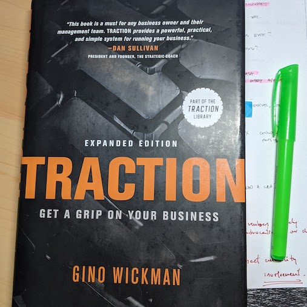

I'm undergoing a strategic planning process at my nonprofit, and also at two of the nonprofits for which I'm a board member. I'm familiar with different approaches to strategic planning, but I want to go deeper. 

### Traction - by Gino Wickman

I've been implementing <a href="https://smile.amazon.com/Traction-Get-Grip-Your-Business/dp/1936661837/" target="_blank">Traction by Gino Wickman</a> at my nonprofit as part of our own internal growth and development. I've found that some element of Traction fit nicely in a strategic planning process: defining the organization's core values, a 10 year goal, a core focus, marketing strategy.  It's a good tool and I will continue to use it. But for strategic planning purposes, it has its limitations. 

### Blue Ocean Strategy - by Renée Mauborgne, Kim, W. Chan

Another resource I've come across is <a href="https://smile.amazon.com/Blue-Ocean-Strategy-Expanded-Uncontested/dp/1625274491/" target="_blank">Blue Ocean Strategy</a>, which has been around for some years now, but I hadn't read it before, or considered it for my nonprofit work.  It's been fun figuring out how to apply it and make it work.  I'm not finished with it, but so far, what I've found that it presents interesting premises that are worth adapting to nonprofit work.

## Sources of sources

I've set out, then, to find the best resources I can learn from about nonprofit strategic planning. 

To do that, first, I defined the following places where I could find good sources: 

1. Harvard Business Review - great essays
2. Harvard Business Must Read collections
3. Google results from "strategic planning syllabus" 
4. Syllabi of courses on strategic planning from the top 5 masters degrees in nonprofit management
5. Syllabi of courses on strategy from the top 5 MBAs
6. Amazon best-seller books on "strategic planning" and "nonprofit strategic planning"
7. Coursera courses and their syllabi

The searches for syllabus of courses didn't pan out. But most of the rest did. I found a list of good books I will be sharing. I also found this <a href="https://www.coursera.org/learn/uva-darden-strategic-planning-execution" target="_blank">Course from UVA.</a>
