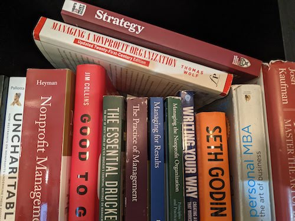

This is a complete list of sources I found online on **strategic planning for nonprofits**, in no particular order.

## Books

Strategic Planning for Public and Nonprofit Organizations: A Guide to Strengthening and Sustaining Organizational Achievement, by John M. Bryson. -- [Read my summary here](summary-of-strategic-planning-for-public-and-nonprofit-organizations-by-john-bryson)

Creating Your Strategic Plan: A Workbook for Public and Nonprofit Organizations, by John M. Bryson, Farnum K. Alston. -- [Read my summary here](summary-of-creating-your-strategic-plan-a-workbook-for-public-and-nonprofit-organizations-by-john-bryson-and-farnum-alston)

Implementing and Sustaining Your Strategic Plan: A Workbook for Public and Nonprofit Organizations, by John M. Bryson, Sharon Roe Anderson, Farnum K. Alston.  

Nonprofit Sustainability: Making Strategic Decisions for Financial Viability eBook, by Jeanne Bell, Jan Masaoka, Steve Zimmerman.

Blue Ocean Shift: Beyond Competing - Proven Steps to Inspire Confidence and Seize New Growth, by W. Chan Kim, Renée Mauborgne.

Strategic Management Concepts, by Frank Rothaermel.

Strategic Planning: A Practical Guide to Strategy Formulation and Execution, by B. Keith Simerson.

The Thin Book of SOAR: Creating Strategy That Inspires Innovation and Engagement 2nd Edition, by Jacqueline M. Stavros, Gina Hinrichs.

Budgeting and Financial Management for Nonprofit Organizations: Using Money to Drive Mission Success First Edition, by Lynne A. Weikart, Greg G. Chen, Edward M. Sermier. 

Strategic Planning For Success: Aligning People, Performance, and Payoffs, by Roger Kaufman, Hugh Oakley-Brown, Ryan Watkins, Doug Leigh.

The Art of the Long View: Planning for the Future in an Uncertain World, by Peter Schwartz.

## Articles

Rethinking Strategic Planning, by Henry Mintzberg.

The fall and rise of Strategic Planning, by Henry Mintzberg.

What is Strategy, by Michael Porter.

What if? The Art of Scenario Thinking for Nonprofits, Diana Scearce, Katherine Fulton, and the Global Business Network Community.

What Is Strategy?, by Michael E. Porter

The Five Competitive Forces That Shape Strategy, by Michael E. Porter.

Building Your Company’s Vision, by James C. Collins and Jerry I. Porras.

Reinventing Your Business Model, by Mark W. Johnson, Clayton M. Christensen, and Henning Kagermann.

Blue Ocean Strategy, by W. Chan Kim and Renée Mauborgne.

The Secrets to Successful Strategy Execution, by Gary L. Neilson, Karla L. Martin, and Elizabeth Powers.

Transforming Corner-Office Strategy into Frontline Action, by Orit Gadiesh and James L. Gilbert.

Turning Great Strategy into Great Performance, by Michael C. Mankins and Richard Steele. 

## Websites

[Managementhelp.org - resources on strategic planning.](https://managementhelp.org/strategicplanning/index.htm#anchor1234?ts=1612480172)

## Online Course: 

[https://www.coursera.org/learn/uva-darden-strategic-planning-execution/home/info](https://www.coursera.org/learn/uva-darden-strategic-planning-execution/home/info)

