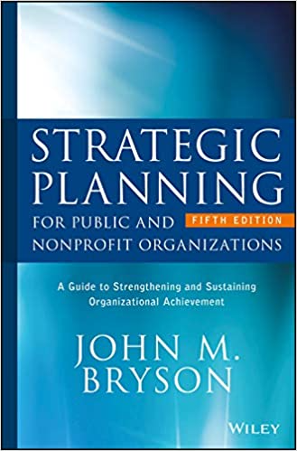
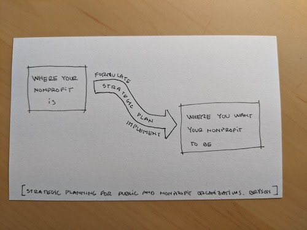

This is my summary of the book "Strategic Planning for Public and Nonprofit Organizations" by John M. Bryson.

## Overview

This book is very well sourced, and goes in depth into the nature of a strategic plan and the process to prepare one. 

It is not an easy or quick read for the regular practitioner that is under pressure to put together a strategic plan. It is a bit expensive, academic in its approach, and lengthy.  It would be very useful for someone who wants to dive deep into any specific part of the strategic planning process, or as a detailed reference source for the practitioner. 

Here is a link to Strategic Planning for Public and Nonprofit Organizations by John M. Bryson on [Amazon](https://smile.amazon.com/Strategic-Planning-Public-Nonprofit-Organizations/dp/1119071607/).

## Summary of most actionable ideas

These are the ideas that I found to be the **most actionable for the nonprofit manager** in the book:

### 1. Purpose

The purpose of the strategic planning process is to **identify fundamental decision and actions** that will help you advance your nonprofit from *where it is* to *where you want it to be*. 

### 2. Attention to stakeholders' concerns is crucial 

Identify and involve both internal and external stakeholders in the strategic planning process from the beginning and get their input. There are several methods for *stakeholder analysis* worth looking into, and discussed at the end of the book as a Resource.

### 3. Strategy Change Cycle

Bryson refers to the strategic planning process as a Strategy Change Cycle that has 10 steps:

1. Initiate and agree on the steps and goals of the strategic panning process. Think the whole thing through before getting started, and get everyone on board on what you are about to do. Define the purpose of it, the steps that you will take, the expected timeline, any deliverables, each person's role in it all, the resources that you will need, and the constraints you are facing.  

2. Identify the organization's formal and informal mandates. These are a collection of an organization's "musts". Informal mandates include expectations created by context or circumstances that an organization fulfills a specific role.  

3. Clarify the organization's values and mission. 

4. Assess the internal and external environment of your organization. The internal environment is comprised by elements under your control, like your resources, inputs, processes, performance, values, competencies, capabilities, and culture. The organization's external environment is not under your control, and includes your stakeholders, competitors, collaborators, trends, events, and other external forces. 

   You can use a *SWOC Analysis* - list and review your organization's internal Strengths and Weaknesses, as well as external Opportunities and Challenges. 

   You can also use *scenarios* to describe hypothetical situations of the organization if specific unrealized variables become defined.  

   Identify the strategic issues that keep the organization from advancing. [drawn graphic] These are critical challenges affecting the organization. Identifying them requires a deep understanding of the information gather in the previous four steps, deep dialogue among the strategic planning team, and the wisdom and emotional intelligence to navigate the conflicts that this step will naturally generate.   

5. Formulate strategies to effectively address these issues. Identify practical, realistic, viable, alternative actions that will address the strategic issues, as well as any obstacles to those actions, and additional steps to address those obstacles as necessary.  

6. Formally review and adopt the strategic plan. This step is necessary mostly in bigger organizations where a formal adoption is required. 

7. Describe a vision of organizational success if the strategies are implemented correctly. Share this vision with everyone in the organization. This will help you lead individuals and reduce the need for micro-managing. People who have a clear image of what success looks like in their minds, will work towards building it. 

8. Develop an effective implementation plan. This plan can include: roles, specific actions, expected results, milestones, timeline, necessary resources, communication process, accountability system, a system to review, monitor, and make necessary corrections to the implementation.

9. Review the adopted plan and adjust as necessary. After your strategic plan has been formulated and is being implemented, be open to new information that challenges the assumptions of your plan or changes a given scenario. Make the necessary adjustments to your plan, and when it's time, prepare for another round of strategic planning. 

If you find this book summary to be interesting and useful to you, please [subscribe](subscribe)

For a complete list of resources on strategic planning, go [here](complete-list-of-sources-on-strategic-planning)

Next, I will be reading and summarizing "Creating Your Strategic Plan: A Workbook for Public and Nonprofit Organizations, by John M. Bryson, Farnum K. Alston." [Subscribe](subscribe) so you don't miss out.

