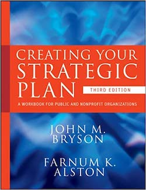

This is my review of "Creating Your Strategic Plan: A Workbook for Public and Nonprofit Organizations", by John M. Bryson, Farnum K. Alston.

This is the workbook companion to ["Strategic Planning for Public and Nonprofit Organizations" by John M. Bryson](summary-of-strategic-planning-for-public-and-nonprofit-organizations-by-john-bryson).  The biggest value of the workbook is the worksheets and templates it gives you for every step of the strategic planning process described in ["Strategic Planning for Public and Nonprofit Organizations" by John M. Bryson](summary-of-strategic-planning-for-public-and-nonprofit-organizations-by-john-bryson). If you found that book to be a good fit for your strategic planning needs then you will appreciate this companion book.

Here is a link to Strategic Planning for Public and Nonprofit Organizations by John M. Bryson on [Amazon](https://smile.amazon.com/Creating-Your-Strategic-Plan-Organizations/dp/047040535X).

